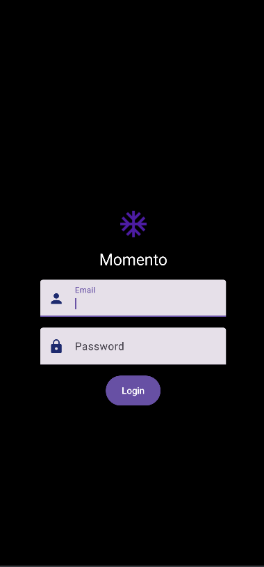
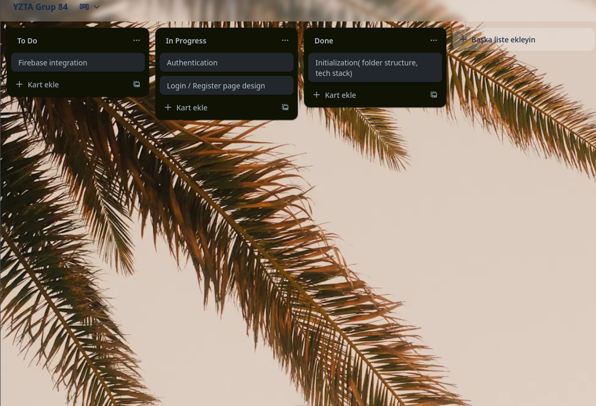
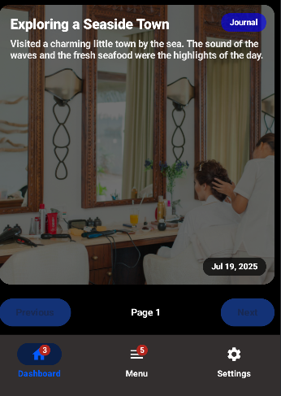
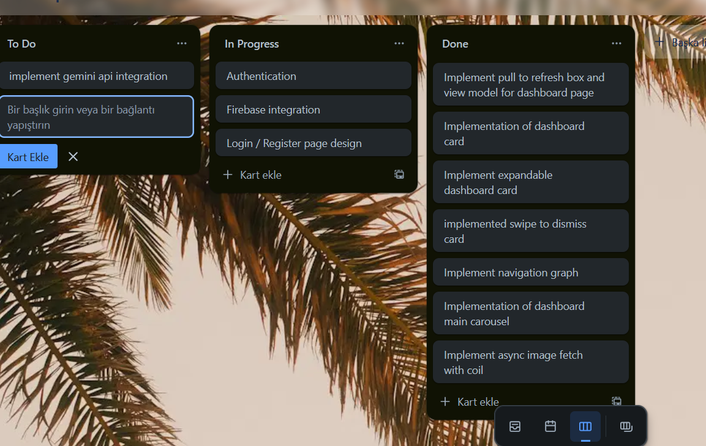
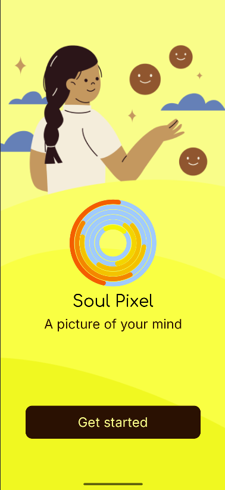
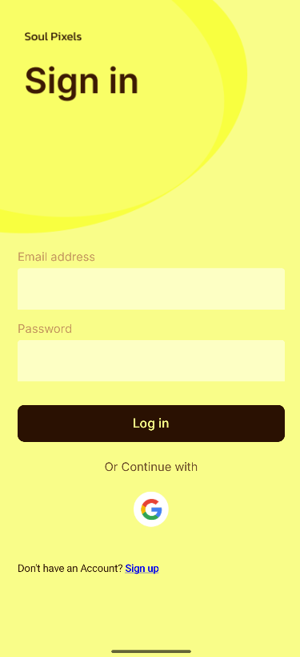
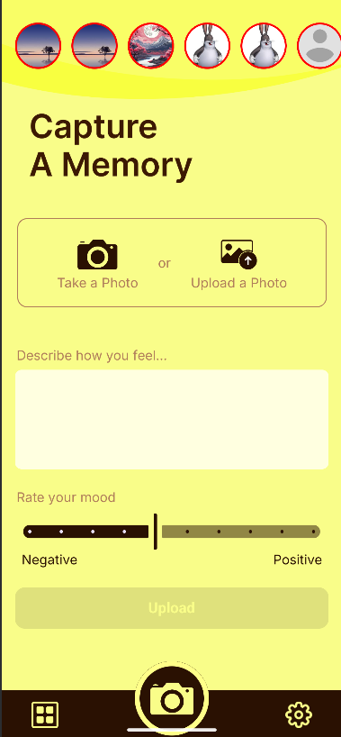
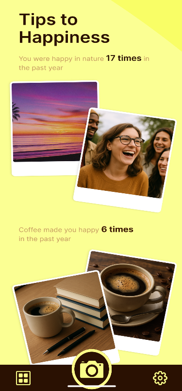
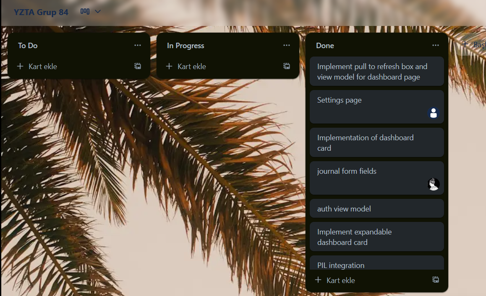

# YZTA Grup 84 Projesi

## Bu proje, günlük yaşamın farkında olmadan üzerimizdeki etkilerini anlamak ve kullanıcılara bu konuda içgörüler sunmak amacıyla geliştirilmiştir.

## 🚀 Ürün Açıklaması: SoulPixel

SoulPixel, kullanıcıların gün içinde farkında olmadan maruz kaldıkları durumların ve ortamların kendilerini nasıl etkilediğini anlamalarına yardımcı olan bir mobil uygulamadır. Uygulama, kullanıcılardan günde üç kez fotoğraf çekmelerini veya kısa günlük girdileri oluşturmalarını isteyecektir. Bu girdiler, **LLM (Büyük Dil Modeli)** ile analiz edilecek ve kullanıcılara kişiselleştirilmiş geri bildirimler sunulacaktır. Ayrıca, kullanıcılara günlük olarak yaşam kalitelerini artırmaya yönelik ipuçları ve tavsiyeler verilecektir.

## 🎯 Hedef Kitle

- Günlük yaşamın duygusal ve zihinsel etkilerini merak eden bireyler.
- Farkındalıklarını artırmak ve kişisel gelişimlerini desteklemek isteyen kullanıcılar.
- Stres yönetimi ve ruh hali takibi konusunda destek arayan kişiler.

---

## 👥 Takım Bilgileri

- **Baha Tütüncüoğlu** - Scrum Master
- **Irmak Simya Dindar** - Product Owner
- **Nazlı Yıldız** - Geliştirici
- **Ömer Asal** - Geliştirici
- **Azra Şahin** - Geliştirici

---

## 📋 Ürün İş Listesi (Product Backlog)

[https://trello.com/b/Y50wdWo3/yzta-grup-84](https://trello.com/b/Y50wdWo3/yzta-grup-84)

## 📊 Sprint Puanlama Mantığı

- **Sprint 1:** 200 puan - İlk planlama ve prototip aşaması
- **Sprint 2:** 300 puan - Sayfaların mock data ile tasarımı ve UI/UX geliştirme aşaması
- **Sprint 3:** 500 puan - Backend ile bağlantı ve final testlerinin yapılacağı sprint

---

## 🗓️ Sprint 1

Detayları Göster

### 📝 Sprint Notları

Bu sprintte projenin temel yapısı ve kullanılacak teknolojiler kararlaştırıldı. Geliştirilecek programın kullanım alanı ve neleri kapsayacağı belirlendi. Bu sprint için beklenen toplam puan: 200.

### 📊 Sprint Puanlama Mantığı & Toplanan Puanlar

Sprint 1 için bütün belirlenen taskler tamamlanıp, toplam 200 puan toplanmıştır

### 📅 Daily Scrum

Projenin temel yapısı ve kullanılacak teknolojilerin belirlenmesi üzerine odaklanıldı.

#### Belgeler ve Ekler

- 
- 
- 

### 🚀 Sprint Review

Sprint sonunda, belirlenen hedeflere ne ölçüde ulaşıldığı ve projenin mevcut durumu değerlendirildi.

### 🔄 Sprint Retrospective

Bu sprintin retrospektifinde **Scrum Master** belirlendi ve takımdaki rollerle ilgili gerekli düzenlemeler yapıldı. Gelecek sprintler için iyileştirme alanları tespit edildi.

---

## 🗓️ Sprint 2

Detayları Göster

### 📝 Sprint Notları

Dashboard swipeable card yapıldı, dashboard carousel implemente edildi, navigation graphdaki buglar giderildi. Tasarım alternatifleri göz önünde bulunduruldu.

### 📊 Sprint Puanlama Mantığı & Toplanan Puanlar

Sprint 2 için belirlenen toplam puan 300 olmakla beraber, bu hafta için belirlenen tasklerin hepsi gerçekleştirilmiş olup toplam 300 puan toplanmıştır.

### 📅 Daily Scrum

- **Simya:** UI tasarımlarını yapmaya başladı
- **Baha:** Dashboard sayfası, seçenekler sayfası ve bunların view model'lerini yapmaya başladı
- **Ömer:** Journal endpoint'leri ve authentication endpoint'leri yapmaya başladı

#### Belgeler ve Ekler

- 
- 
- 

### 🚀 Sprint Review

Sprint sonunda, belirlenen hedeflere ne ölçüde ulaşıldığı ve projenin mevcut durumu değerlendirildi, sprint 3 için daha fazla hızlanmamız gerektiğine karar verildi.

### 🔄 Sprint Retrospective

Biraz yavaş başlansa da, dashboard sayfasının genel yapısı oluşturuldu, sadece backend ile bağlanması kaldı. Navigation graph'ımızdaki hataların hepsi düzeltildi. Takım çok fazla buluşamasa da diğer sprint için daha planlı şekilde planlama planlandı.

---

## 🗓️ Sprint 3

Detayları Göster

### 📝 Sprint Notları

Bu sprintte projenin adı **SoulPixel** olarak değiştirildi ve uygulamanın UI tasarımı yeniden ele alındı(sıfırdan yapıldı). Yapay zeka analizi entegre edilerek, Python **PIL (Pillow)** kütüphanesi aracılığıyla **Gemini** modeli kullanıldı. Kullanıcıların paylaştığı günlükler, Instagram hikayeleri gibi diğer kullanıcılarla paylaşılabilecek şekilde geliştirildi, ancak ana ekranda (dashboard) yalnızca kullanıcının kendi hikayeleri görünecek.

### 📊 Sprint Puanlama Mantığı & Toplanan Puanlar

Sprint 3 için belirlenen toplam puan son sprint olmasından ve eklediğimiz yeni entegrasyonlardan dolayı 500'dür.

### 📅 Daily Scrum

- **Simya:** Uygulamanın yeni adı olan SoulPixel'e uygun olacak şekilde yeni UI/UX tasarımlarını yapmaya başladı.
- **Baha:** Kullanıcıların hikayelerini paylaşabilmesi için gerekli frontend entegrasyonlarını ve dashboardda yalnızca kendi hikayelerinin gösterilmesi için geliştirmeler yaptı.
- **Ömer:** Gemini modelini kullanarak günlüklerin analiz edilmesi için backend tarafında gerekli endpointleri ve Python PIL kütüphanesi entegrasyonunu tamamladı.
- **Nazlı ve Azra:** Geliştirilen yeni özelliklerin test süreçlerine ve bug giderme çalışmalarına odaklandı.

##### Daily scrum yapıldı ancak ekran görüntüsü almayı unuttuğumuz için ekleyemiyoruz.

#### Belgeler ve Ekler

- 
- 
- 
- 
- 

###### Bütün taskler tamamlandı.

### 🚀 Sprint Review

Sprint sonunda, uygulamanın yeni adıyla birlikte tüm yeni özellikler başarılı bir şekilde entegre edildi. Backend bağlantısı ve yapay zeka analizi gibi kritik özelliklerin sorunsuz çalıştığı doğrulandı.

### 🔄 Sprint Retrospective

Sprintin başında yaşanan isim ve tasarım değişikliği süreci, takımın hızlı adaptasyonu sayesinde başarılı bir şekilde atlatıldı. Takım üyeleri arasındaki iletişim ve iş birliğinin artırılması, projenin daha hızlı ilerlemesine ve projeyi vaktinde tamamlamamıza katkı sağladı. Yeni tasarım varolan projeye entegre edildi ve yeni özellikler eklendi.

