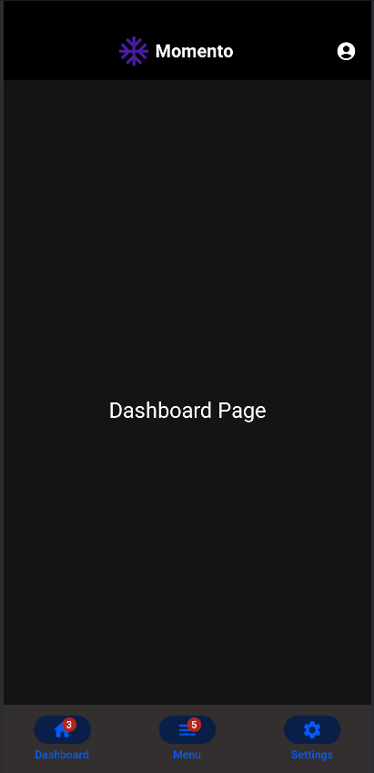
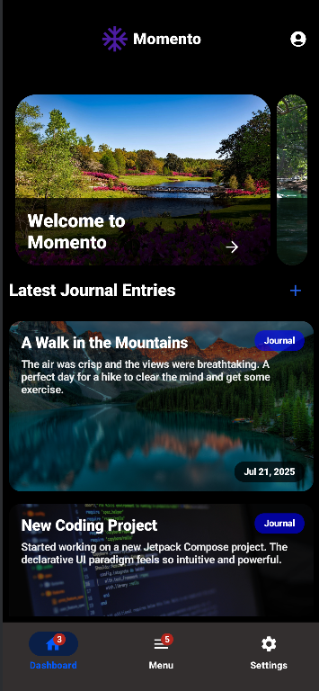

# YZTA Grup 84 Projesi

## Bu proje, günlük yaşamın farkında olmadan üzerimizdeki etkilerini anlamak ve kullanıcılara bu konuda içgörüler sunmak amacıyla geliştirilmiştir.

## 🚀 Ürün Açıklaması: Momento

## Momento, kullanıcıların gün içinde farkında olmadan maruz kaldıkları durumların ve ortamların kendilerini nasıl etkilediğini anlamalarına yardımcı olan bir mobil uygulamadır. Uygulama, kullanıcılardan günde üç kez fotoğraf çekmelerini veya kısa günlük girdileri oluşturmalarını isteyecektir. Bu girdiler, **LLM (Büyük Dil Modeli)** ile analiz edilecek ve kullanıcılara kişiselleştirilmiş geri bildirimler sunulacaktır. Ayrıca, kullanıcılara günlük olarak yaşam kalitelerini artırmaya yönelik ipuçları ve tavsiyeler verilecektir.

## 🎯 Hedef Kitle

- Günlük yaşamın duygusal ve zihinsel etkilerini merak eden bireyler.
- Farkındalıklarını artırmak ve kişisel gelişimlerini desteklemek isteyen kullanıcılar.
- Stres yönetimi ve ruh hali takibi konusunda destek arayan kişiler.

---

## 👥 Takım Bilgileri

- **Baha Tütüncüoğlu** - Scrum Master
- **Irmak Simya Dindar** - Product Owner
- **Nazlı Yıldız** - Geliştirici
- **Ömer Asal** - Geliştirici
- **Azra Şahin** - Geliştirici

---

## 📋 Ürün İş Listesi (Product Backlog)

## [https://trello.com/b/Y50wdWo3/yzta-grup-84](https://trello.com/b/Y50wdWo3/yzta-grup-84)

## 📊 Sprint Puanlama Mantığı

- **Sprint 1:** 200 puan - İlk planlama ve prototip aşaması
- **Sprint 2:** 300 puan - Sayfaların mock data ile tasarımı ve UI/UX geliştirme aşaması
- **Sprint 3:** 500 puan - Backend ile bağlantı ve final testlerinin yapılacağı sprint

## 🗓️ Sprint 1

Detayları Göster

### 📝 Sprint Notları

Bu sprintte projenin temel yapısı ve kullanılacak teknolojiler kararlaştırıldı. Geliştirilecek programın kullanım alanı ve neleri kapsayacağı belirlendi. Bu sprint için beklenen toplam puan: 200.

### 📊 Sprint Puanlama Mantığı & Toplanan Puanlar

Sprint 1 için bütün belirlenen taskler tamamlanıp, toplam 200 puan toplanmıştır

### 📅 Daily Scrum

Projenin temel yapısı ve kullanılacak teknolojilerin belirlenmesi üzerine odaklanıldı.

#### Belgeler ve Ekler

- 
- 
- 

### 🚀 Sprint Review

Sprint sonunda, belirlenen hedeflere ne ölçüde ulaşıldığı ve projenin mevcut durumu değerlendirildi.

### 🔄 Sprint Retrospective

Bu sprintin retrospektifinde **Scrum Master** belirlendi ve takımdaki rollerle ilgili gerekli düzenlemeler yapıldı. Gelecek sprintler için iyileştirme alanları tespit edildi.

---

## 🗓️ Sprint 2

Detayları Göster

### 📝 Sprint Notları

Dashboard swipeable card yapıldı, dashboard carousel implemente edildi, navigation graphdaki buglar giderildi. Tasarım alternatifleri göz önünde bulunduruldu.

### 📊 Sprint Puanlama Mantığı & Toplanan Puanlar

Sprint 2 için belirlenen toplam puan 300 olmakla beraber, bu hafta için belirlenen tasklerin hepsi gerçekleştirilmiş olup toplam 300 puan toplanmıştır.

### 📅 Daily Scrum

- **Simya:** UI tasarımlarını yapmaya başladı
- **Baha:** Dashboard sayfası, seçenekler sayfası ve bunların view model'lerini yapmaya başladı
- **Ömer:** Journal endpoint'leri ve authentication endpoint'leri yapmaya başladı

#### Belgeler ve Ekler

- 
- 
- 

### 🚀 Sprint Review

Sprint sonunda, belirlenen hedeflere ne ölçüde ulaşıldığı ve projenin mevcut durumu değerlendirildi, sprint 3 için daha fazla hızlanmamız gerektiğine karar verildi.

### 🔄 Sprint Retrospective

Biraz yavaş başlansa da, dashboard sayfasının genel yapısı oluşturuldu, sadece backend ile bağlanması kaldı. Navigation graph'ımızdaki hataların hepsi düzeltildi. Takım çok fazla buluşamasa da diğer sprint için daha planlı şekilde planlama planlandı.

###

